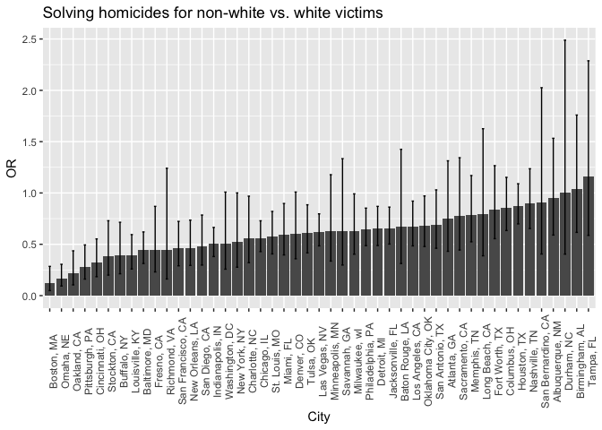

p8105\_hw6\_tm2680
================
Tatini Mal-Sarkar
11/21/2018

Problem 1
=========

``` r
hom_url = "https://raw.githubusercontent.com/washingtonpost/data-homicides/master/homicide-data.csv"

hom_df = 
  read_csv(hom_url) %>% 
  janitor::clean_names() %>% 
  mutate(resolved = as.numeric(disposition == "Closed by arrest"),
         victim_age = as.numeric(victim_age),
         city_state = str_c(city, ", ", state),
         victim_race = as.numeric(victim_race != "White"),
         victim_sex = as.numeric(victim_sex == "Male")) %>% 
  filter(city_state != "Dallas, TX" & city_state != "Phoenix, AZ" & city_state != "Kansas City, MO" & city_state != "Tulsa, AL") %>% 
  select(city_state, resolved, victim_age, victim_race, victim_sex)
```

    ## Parsed with column specification:
    ## cols(
    ##   uid = col_character(),
    ##   reported_date = col_integer(),
    ##   victim_last = col_character(),
    ##   victim_first = col_character(),
    ##   victim_race = col_character(),
    ##   victim_age = col_character(),
    ##   victim_sex = col_character(),
    ##   city = col_character(),
    ##   state = col_character(),
    ##   lat = col_double(),
    ##   lon = col_double(),
    ##   disposition = col_character()
    ## )

    ## Warning in evalq(as.numeric(victim_age), <environment>): NAs introduced by
    ## coercion

``` r
hom_balt_df = 
  hom_df %>% 
  filter(city_state == "Baltimore, MD")

fit_log = 
  hom_balt_df %>% 
  glm(resolved ~ victim_age + victim_sex + victim_race, data = ., family = binomial())

fit_log %>% 
  broom::tidy() %>% 
  mutate(OR = exp(estimate),
         lower_bound = exp(estimate - 1.96*std.error),
         upper_bound = exp(estimate + 1.96*std.error)) %>% 
  select(term, OR, lower_bound, upper_bound)
```

    ## # A tibble: 4 x 4
    ##   term           OR lower_bound upper_bound
    ##   <chr>       <dbl>       <dbl>       <dbl>
    ## 1 (Intercept) 3.27        2.07        5.19 
    ## 2 victim_age  0.993       0.987       0.999
    ## 3 victim_sex  0.412       0.315       0.537
    ## 4 victim_race 0.441       0.313       0.620

The adjusted odds ratio for solving homicides comparing non-white to white victims, keeping all other variables fixed, is 0.4406. We are 95% confident the true value for this OR lies between 0.3129 and 0.6204.

``` r
glm_func = function(df) {
  log = glm(resolved ~ victim_age + victim_sex + victim_race, data = df, family = binomial())
  
  broom::tidy(log) %>% 
    mutate(OR = exp(estimate),
         lower_bound = exp(estimate - 1.96*std.error),
         upper_bound = exp(estimate + 1.96*std.error)) %>% 
    filter(term == "victim_race") %>% 
    select(OR, lower_bound, upper_bound)
}
```

``` r
hom_df_glm = hom_df %>% 
  nest(resolved, victim_age, victim_sex, victim_race) %>% 
  mutate(models = map(data, glm_func)) %>% 
  unnest(models) %>% 
  select(-data)
```

``` r
hom_df_glm %>% 
  mutate(city_state = forcats::fct_reorder(city_state, OR)) %>% 
  ggplot(aes(x = city_state, y = OR)) + 
  geom_bar(stat = "identity") + 
  geom_errorbar(aes(ymin = lower_bound, ymax = upper_bound), width = 0.2) + 
  theme(axis.text.x = element_text(angle = 90)) +
  labs(title = "Solving homicides for non-white vs. white victims",
         x = "City",
         y = "OR")
```



This plot depicts the odds ratio of solving a homicide for a non-white victim compared to a white victim. In cities like Boston, the odds of solving a murder for a non-white victim is 0.118 times the odds of solving a murder for a white victim. We're 95% confident the true value for this OR would lie between 0.049 and 0.285. Because this range doesn't include the null OR value of 1, resolving a homicide and victim race are significantly associated. In other words, in a city like Boston, white victims are likelier to have their case solved. The reverse might hold true in a city like Tampa, where the estimated OR is 1.159. However, because the 95% confidence interval ranges from 0.587 to 2.288, race and resolving a homicide might not be associated.
